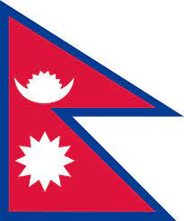

# `Nepal`

Nepal is a landlocked country in South Asia. It is mainly situated in the
Himalayas, but also includes parts of the Indo-Gangetic Plain, bordering the
Tibet Autonomous Region of China to the north, and India in the south, east, and
west, while it is narrowly separated from Bangladesh by the Siliguri Corridor,
and from Bhutan by the Indian state of Sikkim.

## Here are two interesting facts about Nepal

1. 8 out of 10 highest peak mountains in the world lies in Nepal including the
   highest peak in the world "mount Everest"
2. Gautam Buddha was born in Nepal.

**Language**

There are 12 different language spoken in nepal but mainly the national laguage
is spoken widely all over the country.

